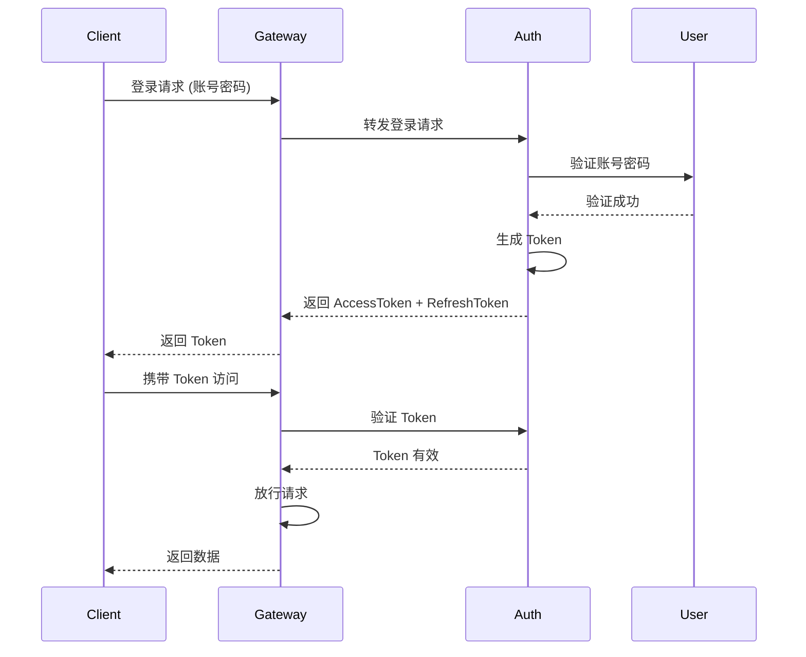
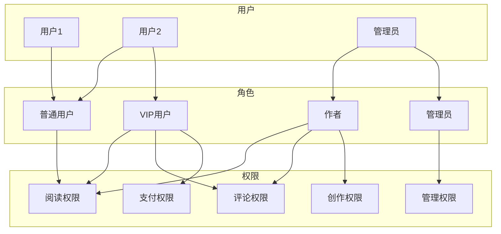
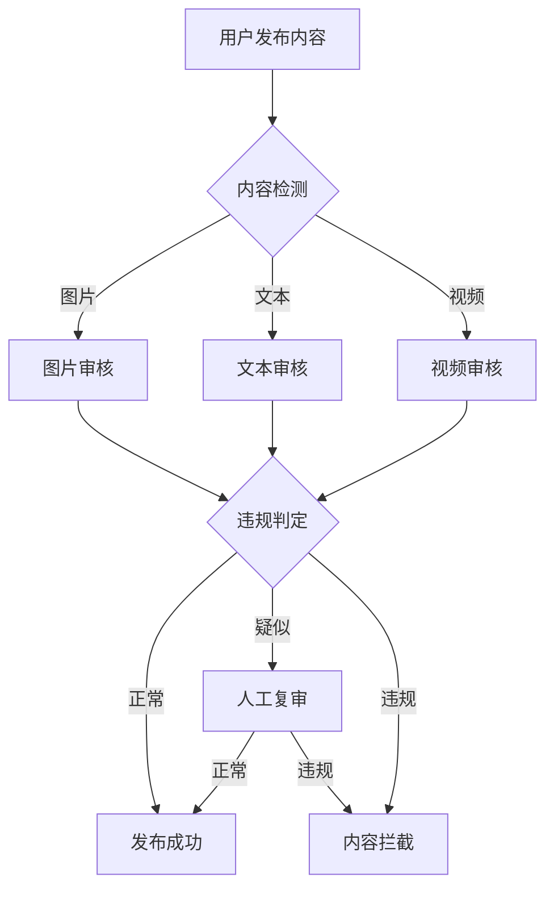
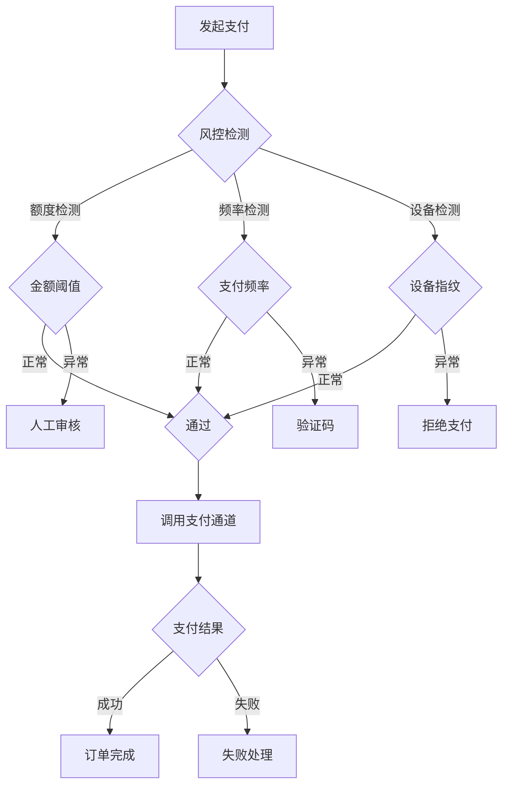

# 安全设计文档

## 文档信息

| 项目 | 内容 |
|------|------|
| 版本 | v1.0.0 |
| 更新日期 | 2024-01-15 |
| 安全负责人 | 安全团队 |

---

## 1. 认证授权

### 1.1 认证机制

#### 1.1.1 JWT Token 认证



#### 1.1.2 Token 配置

| 配置项 | 值 | 说明 |
|--------|-----|------|
| Access Token 有效期 | 2 小时 | JWT 标准 |
| Refresh Token 有效期 | 30 天 | 持久登录 |
| Token 签名算法 | RS256 | 非对称加密 |
| Token 存储 | HttpOnly Cookie | 防止 XSS |

#### 1.1.3 登录安全策略

| 策略 | 配置 | 说明 |
|------|------|------|
| 密码强度 | 8-20位，含大小写字母和数字 | 强制密码强度 |
| 登录失败锁定 | 5次后锁定15分钟 | 防暴力破解 |
| 验证码 | 滑动验证/短信验证码 | 人机识别 |
| 异常登录提醒 | 异地登录通知 | 安全预警 |

### 1.2 授权模型

#### 1.2.1 权限模型 (RBAC)



#### 1.2.2 角色权限矩阵

| 功能 | 普通用户 | VIP用户 | 作者 | 管理员 |
|------|---------|--------|------|--------|
| 阅读免费书籍 | ✅ | ✅ | ✅ | ✅ |
| 阅读付费书籍 | ❌/购买 | ✅ | ✅ | ✅ |
| 评论书评 | ✅ | ✅ | ✅ | ✅ |
| 发布作品 | ❌ | ❌ | ✅ | ✅ |
| 内容审核 | ❌ | ❌ | ❌ | ✅ |
| 用户管理 | ❌ | ❌ | ❌ | ✅ |
| 数据统计 | ❌ | 部分 | ✅ | ✅ |

---

## 2. 数据安全

### 2.1 数据加密

#### 2.1.1 加密策略

| 数据类型 | 加密方式 | 密钥管理 |
|---------|---------|---------|
| 用户密码 | bcrypt (强度 12) | 盐值自动生成 |
| 敏感字段 | AES-256-GCM | AWS KMS / 自建 HSM |
| 传输加密 | TLS 1.3 | CA 证书 |
| 数据库 | 全盘加密 + 列加密 | KMS 管理 |
| 备份 | AES-256 | 独立密钥 |

#### 2.1.2 敏感数据处理

```java
// 敏感数据加密注解
@SensitiveField(EncryptType.AES)
private String phone;

@SensitiveField(EncryptType.AES)
private String email;

@SensitiveField(EncryptType.HASH)
private String idCard;

// 脱敏处理
@SensitiveField(MaskType.PHONE)
private String phoneMask; // 输出: 138****8000

@SensitiveField(MaskType.EMAIL)
private String emailMask; // 输出: 1***@example.com
```

### 2.2 数据脱敏规则

| 字段 | 脱敏规则 | 示例 |
|------|---------|------|
| 手机号 | 中间4位隐藏 | 138****8000 |
| 邮箱 | 域名部分隐藏 | a***@gmail.com |
| 身份证 | 出生日期+住址隐藏 | 110***********1234 |
| 银行卡 | 只显示后4位 | ****1234 |
| 真实姓名 | 只保留姓 | 张* |

### 2.3 数据备份策略

| 项目 | 策略 |
|------|------|
| 全量备份 | 每日凌晨 2:00 |
| 增量备份 | 每小时 |
| 异地备份 | 跨区域实时同步 |
| 备份保留 | 本地 30 天，异地 90 天 |
| 恢复测试 | 每月恢复演练 |

---

## 3. API 安全

### 3.1 接口防护

#### 3.1.1 限流策略

| 接口类型 | QPS 限制 | 说明 |
|---------|---------|------|
| 登录注册 | 10/min | 防暴力破解 |
| 普通接口 | 100/min | 普通用户 |
| VIP 接口 | 300/min | VIP 用户 |
| 搜索接口 | 30/min | 防爬虫 |
| 下载接口 | 20/min | 防滥用 |

#### 3.1.2 限流配置

```yaml
# Sentinel 限流配置
flowRules:
  # 登录接口限流
  - resource: /v1/auth/login
    limitApp: default
    grade: 1  # 限流类型: 1-线程数, 0-QPS
    count: 10
    controlBehavior: 0  # 直接拒绝
    
  # 普通接口限流
  - resource: /v1/**
    limitApp: default
    grade: 0
    count: 100
    controlBehavior: 0
```

### 3.2 Web 安全

#### 3.2.1 安全响应头

```nginx
# Nginx 安全响应头配置
add_header X-Frame-Options "SAMEORIGIN" always;
add_header X-Content-Type-Options "nosniff" always;
add_header X-XSS-Protection "1; mode=block" always;
add_header Referrer-Policy "no-referrer-when-downgrade" always;
add_header Content-Security-Policy "default-src 'self'" always;
add_header Strict-Transport-Security "max-age=31536000; includeSubDomains" always;
```

#### 3.2.2 CSRF 防护

| 防护方式 | 说明 |
|---------|------|
| CSRF Token | 表单提交携带 Token |
| SameSite Cookie | 设置 Cookie 的 SameSite 属性 |
| Referer 校验 | 校验请求来源 |
| 自定义请求头 | API 请求携带自定义头 |

### 3.3 SQL 注入防护

```java
// ✅ 使用预编译语句
@Query("SELECT u FROM User u WHERE u.email = :email")
User findByEmail(@Param("email") String email);

// ❌ 禁止字符串拼接
String sql = "SELECT * FROM user WHERE name = '" + name + "'";
```

### 3.4 XSS 防护

```java
// 输入校验
@NotBlank
@Size(min = 2, max = 50)
@Pattern(regexp = "^[a-zA-Z0-9\\u4e00-\\u9fa5]+$")
private String nickname;

// 输出转义
// 前端使用 React/Vue 自动转义
// 富文本内容使用 DOMPurify 过滤
```

---

## 4. 内容审核

### 4.1 审核流程



### 4.2 审核维度

| 维度 | 检测项 | 处理方式 |
|------|--------|---------|
| 色情低俗 | 裸露、色情描写 | 直接拦截 |
| 暴恐血腥 | 暴力、血腥内容 | 直接拦截 |
| 政治敏感 | 涉政内容 | 人工审核 |
| 虚假信息 | 谣言、欺诈 | 标记提醒 |
| 侵权盗版 | 盗版内容 | 删除+警告 |
| 垃圾广告 | 营销广告 | 删除+限权 |

### 4.3 审核配置

```yaml
# 内容审核规则
moderation:
  text:
    enabled: true
    minConfidence: 0.8
    autoReject: true
    categories:
      - pornography
      - violence
      - political
      - spam
  
  image:
    enabled: true
    minConfidence: 0.85
    autoReject: true
  
  review:
    threshold: 0.6
    queuePriority: high
```

---

## 5. 版权保护

### 5.1 数字版权保护

#### 5.1.1 内容保护措施

| 保护措施 | 说明 |
|---------|------|
| 水印 | 用户水印 + 内容水印 |
| 防盗链 | Referer + Token 验证 |
| 禁止复制 | 禁止选中、复制文字 |
| 录屏检测 | 检测录屏行为并警告 |
| 下载限制 | 限制离线下载范围 |

#### 5.1.2 水印策略

```javascript
// 用户水印
const watermark = {
  text: `${userId} ${username} ${datetime}`,
  fontSize: 12,
  color: 'rgba(0,0,0,0.1)',
  opacity: 0.1,
  position: 'random'
};

// 内容水印
const contentWatermark = {
  type: 'invisible', // 隐水印
  algorithm: 'LSB', // 最低有效位
  data: 'copyright'
};
```

### 5.2 侵权检测

| 检测类型 | 技术手段 | 响应时间 |
|---------|---------|---------|
| 文字重复 | 文本相似度算法 | < 1秒 |
| 图片侵权 | 图像指纹 + 相似搜索 | < 3秒 |
| 音频侵权 | 音频指纹匹配 | < 5秒 |
| 全网监测 | 爬虫 + 相似度分析 | 定期扫描 |

### 5.3 维权处理

| 场景 | 处理方式 |
|------|---------|
| 站内侵权 | 删除内容 + 账号警告 + 扣除积分 |
| 严重侵权 | 封禁账号 + 公开警示 |
| 外部侵权 | 平台维权 + 法律支持 |
| 举报有奖 | 举报成功奖励积分 |

---

## 6. 支付安全

### 6.1 支付风控



### 6.2 风控规则

| 规则 | 阈值 | 处理 |
|------|------|------|
| 单笔金额 | > ¥5000 | 人工审核 |
| 日累计金额 | > ¥20000 | 需验证 |
| 短时频繁支付 | > 5次/小时 | 验证码 |
| 异地登录支付 | 触发 | 短信确认 |
| 新设备支付 | > ¥500 | 短信确认 |

### 6.3 安全支付实践

| 安全措施 | 说明 |
|---------|------|
| 签名验证 | 支付回调签名校验 |
| 订单校验 | 金额、状态一致性校验 |
| 幂等处理 | 防止重复扣款 |
| 回调验证 | 回调来源校验 |
| 敏感加密 | 卡号加密存储 |

---

## 7. 安全运营

### 7.1 威胁监控

| 监控项 | 告警阈值 | 响应时间 |
|--------|---------|---------|
| 异常登录 | 异地登录/失败多次 | < 5分钟 |
| 暴力破解 | 登录失败>10次 | < 5分钟 |
| 接口滥用 | QPS突增>200% | < 10分钟 |
| 恶意请求 | 大量404/403 | < 10分钟 |
| 数据异常 | 批量查询/导出 | < 30分钟 |

### 7.2 安全审计

| 审计类型 | 频率 | 说明 |
|---------|------|------|
| 登录日志 | 实时 | 记录所有登录行为 |
| 操作日志 | 实时 | 关键操作记录 |
| 接口调用日志 | 实时 | API 调用记录 |
| 数据库审计 | 每日 | 敏感操作审计 |
| 安全扫描 | 每周 | 漏洞扫描 |
| 渗透测试 | 季度 | 专业安全测试 |

### 7.3 应急响应

```
┌─────────────────────────────────────────────────────────────────────────┐
│                          安全事件响应流程                                │
├─────────────────────────────────────────────────────────────────────────┤
│                                                                         │
│  发现 ──▶ 评估 ──▶ 遏制 ──▶ 消除 ──▶ 恢复 ──▶ 复盘                       │
│                                                                         │
│  │        │        │        │        │        │                       │
│  ▼        ▼        ▼        ▼        ▼        ▼                       │
│  安全   确定影   隔离问   修复漏   服务   总结经
│  告警   响范围   题影响   洞后门   恢复   验教训
│                                                                         │
│  5min   15min   30min   2hour   4hour   1week                         │
│                                                                         │
└─────────────────────────────────────────────────────────────────────────┘
```

---

## 8. 合规要求

### 8.1 隐私合规

| 法规 | 要求 | 实现 |
|------|------|------|
| GDPR | 数据最小化、用户同意 | 隐私设置、Cookie 同意 |
| CCPA | 数据可删除、opt-out | 注销功能、退订 |
| PIPL | 数据收集同意、跨境限制 | 隐私协议、权限申请 |

### 8.2 安全认证

| 认证 | 状态 | 有效期 |
|------|------|--------|
| ISO 27001 | ✅ 已认证 | 2026-12 |
| SOC 2 Type II | ✅ 已认证 | 2024-06 |
| 等保三级 | ✅ 已认证 | 2025-03 |

---

## 附录

### A. 安全联系方式

- 安全问题：security@10kbooks.com
- 漏洞报告：https://security.10kbooks.com
- 紧急联系：+86 xxx-xxxx-xxxx

### B. 安全文档

- [安全策略](../policies/security.md)
- [隐私协议](../policies/privacy.md)
- [用户协议](../policies/terms.md)
