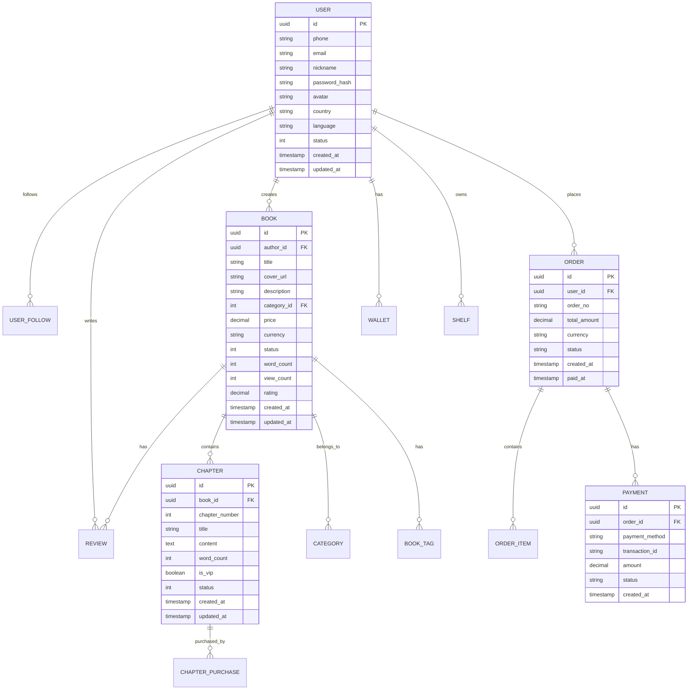
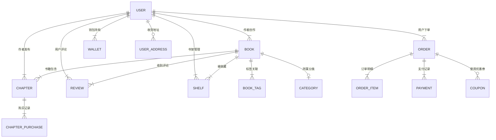

# 数据库设计文档

## 文档信息

| 项目 | 内容 |
|------|------|
| 版本 | v1.0.0 |
| 更新日期 | 2024-01-15 |
| 数据库类型 | MySQL 8.0 |

---

## 1. ER 图 (实体关系图)

### 1.1 整体 ER 关系概览



### 1.2 核心实体关系



---

## 2. 表结构说明

### 2.1 用户相关表

#### 2.1.1 用户表 (user)

| 字段名 | 类型 | 说明 | 约束 |
|--------|------|------|------|
| id | BIGINT UNSIGNED | 用户ID | PK, AUTO_INCREMENT |
| uuid | VARCHAR(36) | 唯一标识 | UNIQUE, INDEX |
| phone | VARCHAR(20) | 手机号 | UNIQUE, INDEX |
| email | VARCHAR(100) | 邮箱 | UNIQUE, INDEX |
| nickname | VARCHAR(50) | 昵称 | NOT NULL |
| password_hash | VARCHAR(255) | 密码哈希 | NOT NULL |
| avatar | VARCHAR(500) | 头像URL | |
| gender | TINYINT | 性别: 0-未知, 1-男, 2-女 | DEFAULT 0 |
| birthday | DATE | 生日 | |
| country | VARCHAR(10) | 国家代码 | DEFAULT 'CN' |
| language | VARCHAR(10) | 语言偏好 | DEFAULT 'zh-CN' |
| bio | TEXT | 个人简介 | |
| role | VARCHAR(20) | 角色: user, author, admin | DEFAULT 'user' |
| status | TINYINT | 状态: 0-禁用, 1-正常, 2-待验证 | DEFAULT 1 |
| last_login_at | DATETIME | 最后登录时间 | |
| last_login_ip | VARCHAR(45) | 最后登录IP | |
| created_at | DATETIME | 创建时间 | DEFAULT CURRENT_TIMESTAMP |
| updated_at | DATETIME | 更新时间 | ON UPDATE CURRENT_TIMESTAMP |

**索引**

| 索引名 | 字段 | 类型 |
|--------|------|------|
| idx_phone | phone | UNIQUE |
| idx_email | email | UNIQUE |
| idx_uuid | uuid | UNIQUE |
| idx_status | status | NORMAL |
| idx_created | created_at | NORMAL |

#### 2.1.2 用户关系表 (user_follow)

| 字段名 | 类型 | 说明 | 约束 |
|--------|------|------|------|
| id | BIGINT UNSIGNED | 主键 | PK, AUTO_INCREMENT |
| follower_id | BIGINT UNSIGNED | 关注者ID | NOT NULL, INDEX |
| following_id | BIGINT UNSIGNED | 被关注者ID | NOT NULL, INDEX |
| created_at | DATETIME | 关注时间 | DEFAULT CURRENT_TIMESTAMP |

**索引**

| 索引名 | 字段 | 类型 |
|--------|------|------|
| idx_follower | follower_id | NORMAL |
| idx_following | following_id | NORMAL |
| idx_relation | follower_id, following_id | UNIQUE |

#### 2.1.3 用户积分表 (user_point)

| 字段名 | 类型 | 说明 | 约束 |
|--------|------|------|------|
| id | BIGINT UNSIGNED | 主键 | PK |
| user_id | BIGINT UNSIGNED | 用户ID | NOT NULL, UNIQUE |
| balance | INT | 积分余额 | DEFAULT 0 |
| total_earned | INT | 历史获得 | DEFAULT 0 |
| total_spent | INT | 历史消费 | DEFAULT 0 |
| updated_at | DATETIME | 更新时间 | |

#### 2.1.4 用户积分变动表 (user_point_log)

| 字段名 | 类型 | 说明 | 约束 |
|--------|------|------|------|
| id | BIGINT UNSIGNED | 主键 | PK |
| user_id | BIGINT UNSIGNED | 用户ID | NOT NULL, INDEX |
| type | TINYINT | 类型: 1-获得, 2-消费 | NOT NULL |
| amount | INT | 变动数量 | NOT NULL |
| source | VARCHAR(30) | 来源 | |
| order_id | BIGINT UNSIGNED | 关联订单 | |
| balance_after | INT | 变动后余额 | |
| created_at | DATETIME | 变动时间 | DEFAULT CURRENT_TIMESTAMP |

### 2.2 内容相关表

#### 2.2.1 书籍表 (book)

| 字段名 | 类型 | 说明 | 约束 |
|--------|------|------|------|
| id | BIGINT UNSIGNED | 书籍ID | PK, AUTO_INCREMENT |
| uuid | VARCHAR(36) | 唯一标识 | UNIQUE, INDEX |
| author_id | BIGINT UNSIGNED | 作者ID | NOT NULL, FK, INDEX |
| category_id | INT UNSIGNED | 分类ID | FK, INDEX |
| title | VARCHAR(200) | 书名 | NOT NULL |
| cover_url | VARCHAR(500) | 封面URL | |
| description | TEXT | 简介 | |
| price | DECIMAL(10,2) | 价格 | DEFAULT 0.00 |
| currency | VARCHAR(10) | 货币单位 | DEFAULT 'CNY' |
| word_count | INT UNSIGNED | 字数 | DEFAULT 0 |
| chapter_count | INT UNSIGNED | 章节数 | DEFAULT 0 |
| view_count | BIGINT UNSIGNED | 阅读量 | DEFAULT 0 |
| recommend_count | INT UNSIGNED | 推荐票数 | DEFAULT 0 |
| collect_count | INT UNSIGNED | 收藏数 | DEFAULT 0 |
| review_count | INT UNSIGNED | 评论数 | DEFAULT 0 |
| rating | DECIMAL(3,2) | 评分 | DEFAULT 0.00 |
| rating_count | INT UNSIGNED | 评分人数 | DEFAULT 0 |
| status | TINYINT | 状态: 0-草稿, 1-审核中, 2-已发布, 3-被禁用 | DEFAULT 0 |
| is_paid | TINYINT | 是否付费: 0-免费, 1-付费 | DEFAULT 0 |
| is_vip | TINYINT | VIP专属 | DEFAULT 0 |
| publish_time | DATETIME | 发布时间 | |
| last_update_time | DATETIME | 最后更新时间 | |
| created_at | DATETIME | 创建时间 | DEFAULT CURRENT_TIMESTAMP |
| updated_at | DATETIME | 更新时间 | ON UPDATE CURRENT_TIMESTAMP |

**索引**

| 索引名 | 字段 | 类型 |
|--------|------|------|
| idx_author | author_id | NORMAL |
| idx_category | category_id | NORMAL |
| idx_status | status | NORMAL |
| idx_publish_time | publish_time | NORMAL |
| idx_rating | rating | NORMAL |
| idx_word_count | word_count | NORMAL |

#### 2.2.2 章节表 (chapter)

| 字段名 | 类型 | 说明 | 约束 |
|--------|------|------|------|
| id | BIGINT UNSIGNED | 章节ID | PK, AUTO_INCREMENT |
| uuid | VARCHAR(36) | 唯一标识 | UNIQUE |
| book_id | BIGINT UNSIGNED | 书籍ID | NOT NULL, FK, INDEX |
| chapter_number | INT UNSIGNED | 章节序号 | NOT NULL |
| title | VARCHAR(200) | 章节标题 | NOT NULL |
| content | MEDIUMTEXT | 章节内容 | |
| word_count | INT UNSIGNED | 字数 | DEFAULT 0 |
| is_vip | TINYINT | 是否VIP章节 | DEFAULT 0 |
| price | DECIMAL(10,2) | 章节价格 | DEFAULT 0.00 |
| status | TINYINT | 状态: 0-草稿, 1-审核中, 2-已发布 | DEFAULT 0 |
| audit_remark | VARCHAR(500) | 审核备注 | |
| published_at | DATETIME | 发布时间 | |
| created_at | DATETIME | 创建时间 | DEFAULT CURRENT_TIMESTAMP |
| updated_at | DATETIME | 更新时间 | ON UPDATE CURRENT_TIMESTAMP |

**索引**

| 索引名 | 字段 | 类型 |
|--------|------|------|
| idx_book | book_id | NORMAL |
| idx_book_number | book_id, chapter_number | UNIQUE |
| idx_published | published_at | NORMAL |

#### 2.2.3 书籍分类表 (category)

| 字段名 | 类型 | 说明 | 约束 |
|--------|------|------|------|
| id | INT UNSIGNED | 分类ID | PK, AUTO_INCREMENT |
| parent_id | INT UNSIGNED | 父分类ID | DEFAULT 0 |
| name | VARCHAR(50) | 分类名称 | NOT NULL |
| name_en | VARCHAR(100) | 英文名 | |
| icon | VARCHAR(200) | 图标 | |
| sort | INT | 排序 | DEFAULT 0 |
| level | TINYINT | 层级 | DEFAULT 1 |
| book_count | INT UNSIGNED | 书籍数量 | DEFAULT 0 |
| status | TINYINT | 状态 | DEFAULT 1 |
| created_at | DATETIME | 创建时间 | DEFAULT CURRENT_TIMESTAMP |

#### 2.2.4 书籍标签表 (book_tag)

| 字段名 | 类型 | 说明 | 约束 |
|--------|------|------|------|
| id | INT UNSIGNED | 标签ID | PK |
| name | VARCHAR(50) | 标签名 | NOT NULL, UNIQUE |
| book_count | INT UNSIGNED | 使用次数 | DEFAULT 0 |
| status | TINYINT | 状态 | DEFAULT 1 |
| created_at | DATETIME | 创建时间 | DEFAULT CURRENT_TIMESTAMP |

#### 2.2.5 书籍-标签关联表 (book_tag_relation)

| 字段名 | 类型 | 说明 | 约束 |
|--------|------|------|------|
| book_id | BIGINT UNSIGNED | 书籍ID | PK, FK |
| tag_id | INT UNSIGNED | 标签ID | PK, FK |

### 2.3 订单相关表

#### 2.3.1 订单表 (order)

| 字段名 | 类型 | 说明 | 约束 |
|--------|------|------|------|
| id | BIGINT UNSIGNED | 订单ID | PK, AUTO_INCREMENT |
| order_no | VARCHAR(32) | 订单号 | UNIQUE, INDEX |
| user_id | BIGINT UNSIGNED | 用户ID | NOT NULL, FK, INDEX |
| total_amount | DECIMAL(12,2) | 订单总额 | NOT NULL |
| discount_amount | DECIMAL(12,2) | 优惠金额 | DEFAULT 0.00 |
| pay_amount | DECIMAL(12,2) | 实付金额 | NOT NULL |
| currency | VARCHAR(10) | 货币 | DEFAULT 'CNY' |
| status | TINYINT | 状态: 0-待支付, 1-已支付, 2-已取消, 3-已退款 | DEFAULT 0 |
| payment_method | VARCHAR(20) | 支付方式 | |
| paid_at | DATETIME | 支付时间 | |
| cancel_at | DATETIME | 取消时间 | |
| expire_at | DATETIME | 过期时间 | |
| created_at | DATETIME | 创建时间 | DEFAULT CURRENT_TIMESTAMP |
| updated_at | DATETIME | 更新时间 | ON UPDATE CURRENT_TIMESTAMP |

#### 2.3.2 订单明细表 (order_item)

| 字段名 | 类型 | 说明 | 约束 |
|--------|------|------|------|
| id | BIGINT UNSIGNED | 明细ID | PK, AUTO_INCREMENT |
| order_id | BIGINT UNSIGNED | 订单ID | NOT NULL, FK, INDEX |
| item_type | TINYINT | 类型: 1-书籍, 2-章节, 3-VIP, 4-积分包 | NOT NULL |
| item_id | BIGINT UNSIGNED | 商品ID | NOT NULL |
| item_name | VARCHAR(200) | 商品名称 | NOT NULL |
| price | DECIMAL(10,2) | 单价 | NOT NULL |
| quantity | INT | 数量 | DEFAULT 1 |
| subtotal | DECIMAL(12,2) | 小计 | NOT NULL |
| created_at | DATETIME | 创建时间 | DEFAULT CURRENT_TIMESTAMP |

#### 2.3.3 支付记录表 (payment)

| 字段名 | 类型 | 说明 | 约束 |
|--------|------|------|------|
| id | BIGINT UNSIGNED | 支付ID | PK, AUTO_INCREMENT |
| payment_no | VARCHAR(64) | 支付流水号 | UNIQUE |
| order_no | VARCHAR(32) | 订单号 | NOT NULL, INDEX |
| user_id | BIGINT UNSIGNED | 用户ID | NOT NULL, FK |
| channel | VARCHAR(20) | 支付渠道: alipay, wechat, apple | NOT NULL |
| channel_transaction_id | VARCHAR(128) | 渠道流水号 | INDEX |
| amount | DECIMAL(12,2) | 支付金额 | NOT NULL |
| currency | VARCHAR(10) | 货币 | DEFAULT 'CNY' |
| status | TINYINT | 状态: 0-待支付, 1-成功, 2-失败, 3-已退款 | DEFAULT 0 |
| raw_response | TEXT | 渠道原始响应 | |
| paid_at | DATETIME | 支付成功时间 | |
| created_at | DATETIME | 创建时间 | DEFAULT CURRENT_TIMESTAMP |
| updated_at | DATETIME | 更新时间 | ON UPDATE CURRENT_TIMESTAMP |

### 2.4 钱包相关表

#### 2.4.1 钱包表 (wallet)

| 字段名 | 类型 | 说明 | 约束 |
|--------|------|------|------|
| id | BIGINT UNSIGNED | 钱包ID | PK |
| user_id | BIGINT UNSIGNED | 用户ID | NOT NULL, UNIQUE |
| balance | DECIMAL(12,2) | 余额 | DEFAULT 0.00 |
| frozen_balance | DECIMAL(12,2) | 冻结金额 | DEFAULT 0.00 |
| total_recharge | DECIMAL(12,2) | 历史充值 | DEFAULT 0.00 |
| total_withdraw | DECIMAL(12,2) | 历史提现 | DEFAULT 0.00 |
| updated_at | DATETIME | 更新时间 | |

#### 2.4.2 钱包变动表 (wallet_log)

| 字段名 | 类型 | 说明 | 约束 |
|--------|------|------|------|
| id | BIGINT UNSIGNED | 记录ID | PK |
| user_id | BIGINT UNSIGNED | 用户ID | NOT NULL, INDEX |
| type | TINYINT | 类型: 1-充值, 2-消费, 3-退款, 4-提现, 5-冻结, 6-解冻 | NOT NULL |
| amount | DECIMAL(12,2) | 变动金额 | NOT NULL |
| balance_before | DECIMAL(12,2) | 变动前余额 | |
| balance_after | DECIMAL(12,2) | 变动后余额 | |
| source | VARCHAR(30) | 来源 | |
| order_no | VARCHAR(32) | 关联订单号 | INDEX |
| remark | VARCHAR(500) | 备注 | |
| created_at | DATETIME | 变动时间 | DEFAULT CURRENT_TIMESTAMP |

### 2.5 阅读相关表

#### 2.5.1 书架表 (shelf)

| 字段名 | 类型 | 说明 | 约束 |
|--------|------|------|------|
| id | BIGINT UNSIGNED | 记录ID | PK |
| user_id | BIGINT UNSIGNED | 用户ID | NOT NULL, INDEX |
| book_id | BIGINT UNSIGNED | 书籍ID | NOT NULL, FK, INDEX |
| read_progress | DECIMAL(5,2) | 阅读进度(%) | DEFAULT 0.00 |
| last_chapter_id | BIGINT UNSIGNED | 最后阅读章节 | |
| last_position | INT | 最后阅读位置 | DEFAULT 0 |
| is_favorite | TINYINT | 是否收藏 | DEFAULT 0 |
| created_at | DATETIME | 添加时间 | DEFAULT CURRENT_TIMESTAMP |
| updated_at | DATETIME | 更新时间 | |

**索引**

| 索引名 | 字段 | 类型 |
|--------|------|------|
| idx_user | user_id | NORMAL |
| idx_book | book_id | NORMAL |
| idx_user_book | user_id, book_id | UNIQUE |

#### 2.5.2 章节购买记录表 (chapter_purchase)

| 字段名 | 类型 | 说明 | 约束 |
|--------|------|------|------|
| id | BIGINT UNSIGNED | 记录ID | PK |
| user_id | BIGINT UNSIGNED | 用户ID | NOT NULL, INDEX |
| book_id | BIGINT UNSIGNED | 书籍ID | NOT NULL, FK |
| chapter_id | BIGINT UNSIGNED | 章节ID | NOT NULL, FK, INDEX |
| order_no | VARCHAR(32) | 订单号 | NOT NULL |
| price | DECIMAL(10,2) | 购买价格 | NOT NULL |
| created_at | DATETIME | 购买时间 | DEFAULT CURRENT_TIMESTAMP |

**索引**

| 索引名 | 字段 | 类型 |
|--------|------|------|
| idx_user_book | user_id, book_id | NORMAL |
| idx_user_chapter | user_id, chapter_id | UNIQUE |

### 2.6 社交相关表

#### 2.6.1 评论表 (review)

| 字段名 | 类型 | 说明 | 约束 |
|--------|------|------|------|
| id | BIGINT UNSIGNED | 评论ID | PK |
| book_id | BIGINT UNSIGNED | 书籍ID | NOT NULL, FK, INDEX |
| user_id | BIGINT UNSIGNED | 用户ID | NOT NULL, FK |
| parent_id | BIGINT UNSIGNED | 父评论ID | DEFAULT 0 |
| rating | TINYINT | 评分 1-5 | DEFAULT 5 |
| content | TEXT | 评论内容 | NOT NULL |
| like_count | INT UNSIGNED | 点赞数 | DEFAULT 0 |
| reply_count | INT UNSIGNED | 回复数 | DEFAULT 0 |
| is_spoiler | TINYINT | 是否剧透 | DEFAULT 0 |
| status | TINYINT | 状态 | DEFAULT 1 |
| created_at | DATETIME | 发布时间 | DEFAULT CURRENT_TIMESTAMP |
| updated_at | DATETIME | 更新时间 | |

#### 2.6.2 动态表 (feed)

| 字段名 | 类型 | 说明 | 约束 |
|--------|------|------|------|
| id | BIGINT UNSIGNED | 动态ID | PK |
| user_id | BIGINT UNSIGNED | 发布者ID | NOT NULL, INDEX |
| type | VARCHAR(20) | 类型: post, review, reading | NOT NULL |
| content | TEXT | 内容 | |
| images | JSON | 图片列表 | |
| book_id | BIGINT UNSIGNED | 关联书籍 | |
| visibility | VARCHAR(20) | 可见性: public, friends, private | DEFAULT 'public' |
| like_count | INT UNSIGNED | 点赞数 | DEFAULT 0 |
| comment_count | INT UNSIGNED | 评论数 | DEFAULT 0 |
| status | TINYINT | 状态 | DEFAULT 1 |
| created_at | DATETIME | 发布时间 | DEFAULT CURRENT_TIMESTAMP |

---

## 3. 索引策略

### 3.1 索引设计原则

| 原则 | 说明 |
|------|------|
| **选择区分度高的字段** | 区分度 > 0.1 的字段适合建立索引 |
| **控制索引数量** | 单表索引不超过 5 个 |
| **复合索引遵循最左前缀** | 复合索引 (a,b,c) 支持 a, ab, abc 查询 |
| **避免冗余索引** | 相同查询效果的索引不应重复创建 |
| **定期维护** | 定期分析索引使用情况，删除无效索引 |

### 3.2 核心查询索引规划

#### 用户模块

| 场景 | 索引设计 |
|------|---------|
| 按手机号登录 | idx_phone (phone) |
| 按邮箱登录 | idx_email (email) |
| 用户列表查询 | idx_status_created (status, created_at) |
| 关注列表 | idx_follower (follower_id) |
| 粉丝列表 | idx_following (following_id) |

#### 内容模块

| 场景 | 索引设计 |
|------|---------|
| 作者作品列表 | idx_author_status (author_id, status) |
| 分类书籍列表 | idx_category_status (category_id, status) |
| 书籍搜索 | idx_title (title) |
| 章节查询 | idx_book_number (book_id, chapter_number) |
| 推荐列表 | idx_rating (rating) |

#### 订单模块

| 场景 | 索引设计 |
|------|---------|
| 用户订单 | idx_user_created (user_id, created_at) |
| 订单号查询 | idx_order_no (order_no) |
| 支付流水 | idx_channel_txid (channel_transaction_id) |

### 3.3 分库分表策略

当单表数据量超过 5000 万条时，考虑分库分表：

| 分片键 | 分片策略 | 说明 |
|--------|---------|------|
| user_id | Hash % N | 用户相关表 |
| book_id | Hash % N | 书籍相关表 |
| order_no | Range | 订单表按时间范围 |

---

## 4. 数据字典

### 4.1 状态枚举

#### 用户状态 (user.status)

| 值 | 说明 |
|----|------|
| 0 | 禁用 |
| 1 | 正常 |
| 2 | 待验证 |

#### 用户角色 (user.role)

| 值 | 说明 |
|----|------|
| user | 普通用户 |
| author | 作者 |
| vip | VIP会员 |
| admin | 管理员 |

#### 书籍状态 (book.status)

| 值 | 说明 |
|----|------|
| 0 | 草稿 |
| 1 | 审核中 |
| 2 | 已发布 |
| 3 | 被禁用 |

#### 订单状态 (order.status)

| 值 | 说明 |
|----|------|
| 0 | 待支付 |
| 1 | 已支付 |
| 2 | 已取消 |
| 3 | 已退款 |

#### 支付状态 (payment.status)

| 值 | 说明 |
|----|------|
| 0 | 待支付 |
| 1 | 成功 |
| 2 | 失败 |
| 3 | 已退款 |

#### 支付渠道 (payment.channel)

| 值 | 说明 |
|----|------|
| alipay | 支付宝 |
| wechat | 微信支付 |
| apple | Apple Pay |
| google | Google Pay |

### 4.2 数据脱敏规则

| 字段 | 脱敏规则 | 示例 |
|------|---------|------|
| phone | 中间4位脱敏 | 138****8000 |
| email | 域名部分脱敏 | a***@example.com |
| id_card | 生日和住址脱敏 | 110***********1234 |
| bank_account | 只保留后4位 | ****1234 |
| real_name | 只保留姓 | 张* |

---

## 5. 数据库规范

### 5.1 命名规范

| 类型 | 规范 | 示例 |
|------|------|------|
| 表名 | 小写字母 + 下划线 | user, book_order |
| 字段名 | 小写字母 + 下划线 | user_id, created_at |
| 索引名 | idx_表名_字段 | idx_user_phone |
| 主键 | id 或 表名_id | id, user_id |
| 外键 | 主表_id | author_id, book_id |
| 时间字段 | _at 或 _time | created_at, update_time |

### 5.2 SQL 编写规范

```sql
-- ✅ 推荐：使用字段名而非 SELECT *
SELECT id, username, email FROM user WHERE status = 1;

-- ✅ 推荐：使用预编译语句
PREPARE stmt FROM 'SELECT * FROM user WHERE id = ?';
EXECUTE stmt USING @user_id;

-- ✅ 推荐：批量操作
INSERT INTO book (title, author_id) VALUES ('书1', 1), ('书2', 1);

-- ❌ 禁止：SELECT *
SELECT * FROM user;

-- ❌ 禁止：LIKE 开头使用通配符
SELECT * FROM book WHERE title LIKE '%小说';
```

### 5.3 性能注意事项

1. **避免全表扫描**：确保 WHERE 条件有索引支持
2. **控制返回数量**：使用 LIMIT 限制结果集
3. **分页优化**：使用延迟关联优化深分页
4. **批量操作**：减少数据库交互次数
5. **事务控制**：事务时间不宜过长

---

## 附录

### A. 数据库维护脚本

```sql
-- 分析表
ANALYZE TABLE user;

-- 优化表
OPTIMIZE TABLE book;

-- 检查表
CHECK TABLE chapter;

-- 修复表
REPAIR TABLE order;
```

### B. 联系方式

- DBA 团队：dba@10kbooks.com
